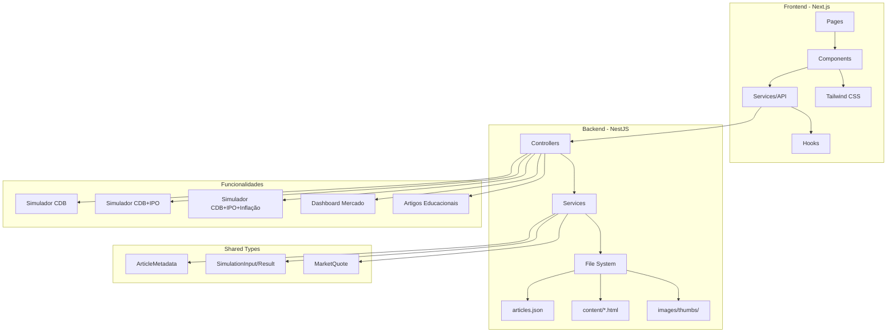

# InvestSim Pro

🚀 **Plataforma completa de simulação de investimentos e educação financeira**

Site de investimentos focado em simulação, educação e visualização de dados, construído com NestJS + Next.js.

---

## 📋 Índice

- [Visão Geral](#-visão-geral)
- [Diagrama de Arquitetura](#-diagrama-de-arquitetura)  
- [Stack Tecnológica](#-stack-tecnológica)
- [Funcionalidades](#-funcionalidades)
- [Estrutura do Projeto](#-estrutura-do-projeto)
- [Modelos de Dados](#-modelos-de-dados)
- [Endpoints REST](#-endpoints-rest)
- [Como Executar](#-como-executar)
- [Componentes Next.js](#-componentes-nextjs)
- [Configurações](#-configurações)

---

## 🎯 Visão Geral

O **InvestSim Pro** é uma plataforma educacional completa que oferece:

- **Simulações avançadas** de investimentos (CDB, IPO, Inflação)
- **Dashboard trader** com cotações em tempo real
- **Artigos educacionais** sobre mercado financeiro
- **Interface moderna** com tema escuro
- **Sistema baseado em arquivos** (sem banco de dados)

---

## 🏗 Diagrama de Arquitetura



---

## 🛠 Stack Tecnológica

### Backend
- **NestJS** (TypeScript) - Framework Node.js
- **File System** - Armazenamento em JSON/HTML
- **Swagger** - Documentação automática da API
- **Class Validator** - Validação de dados

### Frontend  
- **Next.js 14** (TypeScript) - Framework React
- **Tailwind CSS** - Estilização e tema escuro
- **Recharts** - Gráficos e visualizações
- **Axios** - Cliente HTTP
- **Lucide React** - Ícones modernos

### Desenvolvimento
- **ESLint + Prettier** - Qualidade de código
- **TypeScript** - Tipagem estática
- **Hot Reload** - Desenvolvimento ágil

---

## ✨ Funcionalidades

### 🧮 Simuladores de Investimento

#### 1. **CDB Básico**
- Cálculo de rendimento com taxa CDI
- Tributação regressiva de IR
- Projeção de ganhos líquidos

#### 2. **CDB + IPO**  
- Combinação de renda fixa + ações
- Diversificação de portfólio
- Análise comparativa de retorno

#### 3. **CDB + IPO + Inflação**
- Cálculo de ganho real
- Impacto da inflação no patrimônio
- Poder de compra futuro

### 📊 Dashboard Trader
- **Ticker animado** com cotações em tempo real
- **Gráficos interativos** (1D, 1W, 1M, 1Y)
- **Índices brasileiros** (Ibovespa, IFIX, SMLL)
- **Moedas** (USD, EUR, GBP vs BRL)
- **Criptomoedas** (Bitcoin)
- **Taxas oficiais** (CDI, Selic)

### 📚 Sistema de Artigos
- **Conteúdo educacional** sobre investimentos
- **Sistema baseado em arquivos** (JSON + HTML)
- **Metadados estruturados** (tags, tempo de leitura)
- **Busca por categoria** e tags

---

## 📂 Estrutura do Projeto

```
invest_nest_next_base/
├── 📁 backend/                    # API NestJS
│   ├── 📁 src/
│   │   ├── 📁 articles/          # Módulo de artigos
│   │   │   ├── articles.controller.ts
│   │   │   ├── articles.service.ts
│   │   │   └── articles.module.ts
│   │   ├── 📁 simulation/        # Módulo de simulação
│   │   │   ├── simulation.controller.ts
│   │   │   ├── simulation.service.ts
│   │   │   └── simulation.module.ts
│   │   ├── 📁 market/           # Módulo de mercado
│   │   │   ├── market.controller.ts
│   │   │   ├── market.service.ts
│   │   │   └── market.module.ts
│   │   ├── app.module.ts
│   │   └── main.ts
│   ├── 📁 data/                 # Dados dos artigos
│   │   ├── articles.json        # Índice de metadados
│   │   ├── 📁 content/          # Conteúdo HTML
│   │   │   ├── cdb-basico.html
│   │   │   ├── ipo-conceitos.html
│   │   │   └── inflacao-impactos.html
│   │   └── 📁 images/thumbs/    # Miniaturas
│   └── package.json
├── 📁 frontend/                  # App Next.js
│   ├── 📁 src/
│   │   ├── 📁 app/              # App Router (Next.js 14)
│   │   │   ├── layout.tsx
│   │   │   ├── page.tsx
│   │   │   ├── 📁 simulators/
│   │   │   ├── 📁 market/
│   │   │   └── 📁 articles/
│   │   ├── 📁 components/       # Componentes React
│   │   │   ├── 📁 layout/
│   │   │   ├── 📁 simulation/
│   │   │   ├── 📁 market/
│   │   │   └── 📁 articles/
│   │   ├── 📁 lib/              # Serviços e utilitários
│   │   │   └── api.ts
│   │   ├── 📁 hooks/            # Hooks customizados
│   │   └── 📁 styles/           # Estilos Tailwind
│   └── package.json
├── 📁 shared/                   # Tipos compartilhados
│   └── 📁 types/
│       ├── article.types.ts
│       ├── simulation.types.ts
│       ├── market.types.ts
│       └── index.ts
├── package.json                 # Scripts raiz
└── README.md
```

---

## 📊 Modelos de Dados

### ArticleMetadata
```typescript
interface ArticleMetadata {
  id: number;
  title: string;
  slug: string;
  date: string;
  thumbUrl: string;
  description?: string;
  tags?: string[];
  readTime?: number;
}
```

### CDB Simulações
```typescript
interface CDBBasicInput {
  initialAmount: number;    // Valor inicial
  rate: number;            // Taxa CDI (ex: 13.75%)
  period: number;          // Período em dias
  cdbRate: number;         // % do CDI (ex: 110%)
}

interface CDBBasicResult {
  initialAmount: number;
  finalAmount: number;
  grossReturn: number;     // Rendimento bruto
  tax: number;            // IR a pagar
  netReturn: number;      // Rendimento líquido
  netYield: number;       // Rentabilidade %
  taxRate: number;        // Alíquota IR
  period: number;
}
```

### Market Data
```typescript
interface MarketQuote {
  symbol: string;          // Ex: "USDBRL"
  name: string;           // "Dólar Americano"
  price: number;
  change: number;         // Variação absoluta
  changePercent: number;  // Variação %
  lastUpdate: string;
  currency: string;
}
```

---

## 🌐 Endpoints REST

### 📚 Artigos
```http
GET    /api/articles              # Lista todos os artigos
GET    /api/articles/recent       # Artigos recentes
GET    /api/articles/:slug        # Artigo específico
GET    /api/articles?tags=cdb,ipo # Filtro por tags
```

### 🧮 Simulações
```http
POST   /api/simulation/cdb-basic           # CDB básico
POST   /api/simulation/cdb-ipo             # CDB + IPO
POST   /api/simulation/cdb-ipo-inflation   # CDB + IPO + Inflação
POST   /api/simulation/helpers/years-to-days    # Utilitário
POST   /api/simulation/helpers/months-to-days   # Utilitário
```

### 📈 Mercado
```http
GET    /api/market/quotes         # Cotações principais
GET    /api/market/currencies     # Moedas
GET    /api/market/indices        # Índices (Ibovespa, etc)
GET    /api/market/chart/:symbol  # Dados para gráficos
GET    /api/market/rates/cdi      # Taxa CDI atual
GET    /api/market/rates/selic    # Taxa Selic atual
GET    /api/market/rates/cdi/history # Histórico CDI
```

---

## 🚀 Como Executar

### Instalação Completa
```bash
# Clone o repositório
git clone <repository-url>
cd invest_nest_next_base

# Instalar todas as dependências
npm run install:all

# Executar em modo desenvolvimento (ambos simultaneamente)
npm run dev
```

### Execução Individual

#### Backend (NestJS) - Porta 3001
```bash
cd backend
npm install
npm run start:dev

# Documentação Swagger disponível em:
# http://localhost:3001/api/docs
```

#### Frontend (Next.js) - Porta 3000  
```bash
cd frontend
npm install
npm run dev

# Aplicação disponível em:
# http://localhost:3000
```

### Build para Produção
```bash
# Build completo
npm run build

# Executar produção
npm run start
```

---

## ⚛️ Componentes Next.js

### Layout e Navegação
- **`Navbar`** - Navegação responsiva com menu mobile
- **`Hero`** - Seção principal da homepage
- **`Footer`** - Rodapé com informações

### Mercado e Trading
- **`MarketTicker`** - Ticker animado com cotações
- **`MarketCharts`** - Gráficos interativos com Recharts
- **`QuoteCard`** - Card de cotação individual
- **`ChartWidget`** - Widget de gráfico reutilizável

### Simulação
- **`SimulationCards`** - Grid de simuladores
- **`CDBSimulator`** - Formulário CDB básico
- **`CDBIPOSimulator`** - Formulário CDB + IPO
- **`InflationSimulator`** - Formulário com inflação
- **`ResultsDisplay`** - Exibição de resultados

### Artigos
- **`FeaturedArticles`** - Artigos em destaque
- **`ArticleCard`** - Card de artigo
- **`ArticleContent`** - Renderização do conteúdo HTML
- **`ArticleList`** - Lista com filtros

---

## ⚙️ Configurações

### Environment Variables
```bash
# Backend (.env)
PORT=3001
NODE_ENV=development

# Frontend (.env.local)
API_BASE_URL=http://localhost:3001
NEXT_PUBLIC_APP_NAME=InvestSim Pro
```

### Tailwind CSS
- **Tema escuro** configurado por padrão
- **Cores personalizadas** para trading (verde/vermelho)
- **Animações** para ticker e transições
- **Grid responsivo** para diferentes dispositivos
- **Fontes** Inter + JetBrains Mono

### TypeScript
- **Strict mode** habilitado
- **Path mapping** configurado (`@/components`, `@/lib`)
- **Tipos compartilhados** entre frontend e backend
- **Validação em tempo de build**

---

## 🎨 Design System

### Cores Principais
```css
--primary: #0ea5e9      /* Azul principal */
--success: #22c55e      /* Verde (alta) */
--danger: #ef4444       /* Vermelho (baixa) */
--background: #0a0e1a   /* Fundo escuro */
--card: #1a1f2e         /* Cards */
```

### Componentes Base
- **Cards** com backdrop blur
- **Botões** com estados hover/focus
- **Inputs** com validação visual
- **Gráficos** com tema consistente
- **Loading states** e skeleton loaders

---

## 📈 Próximos Passos

- [ ] **Autenticação** - Login/registro de usuários
- [ ] **Favoritos** - Salvar simulações e artigos
- [ ] **Histórico** - Acompanhar simulações passadas
- [ ] **Alertas** - Notificações de mercado
- [ ] **API Externa** - Dados reais de cotações
- [ ] **PWA** - Aplicativo web progressivo
- [ ] **Testes** - Jest + Testing Library
- [ ] **Docker** - Containerização
- [ ] **Deploy** - CI/CD pipeline

---

**Desenvolvido com ❤️ para educação financeira**
